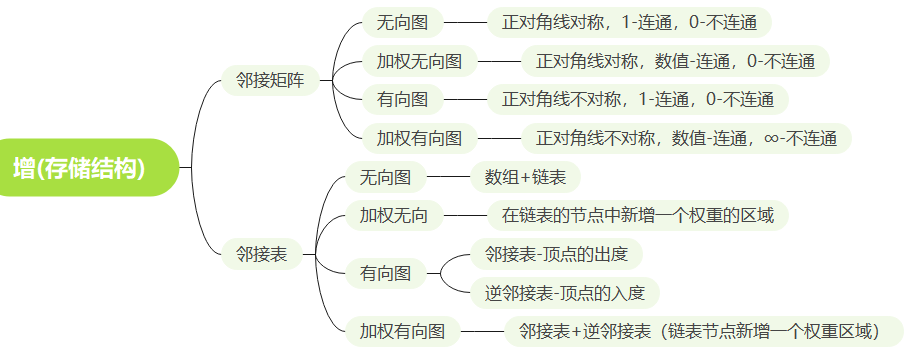
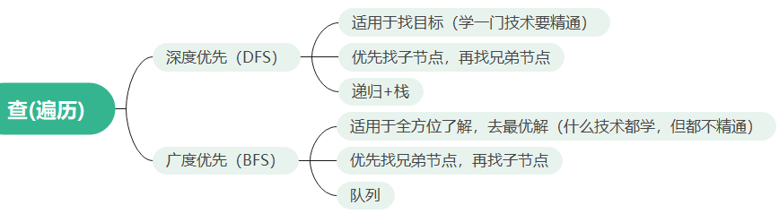
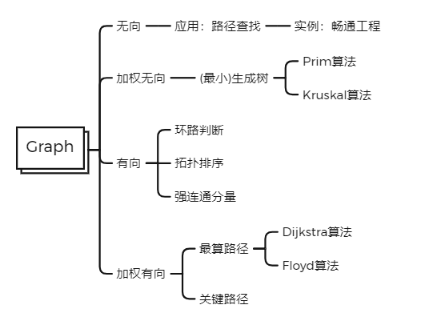

**本仓库说明：**

- 数据结构的原理以及实现代码
- 实现语言：C/C++，Java

**本仓库的意义：**

1. 分享：在自己学习数据结构时，所积累的实现代码、优秀代码
2. 存储：积累优秀的代码片段、优秀的实现思想，便于查询使用

**如何利用本仓库：**

- 技术博客上（https://blog.hackyle.com）是完整的图文讲解，因为在GitHub上不方面展示大量的文字和图表说明，当代码量过多后，将会移存到这里；
- 大量的数据结构实现的实例代码；

**开发环境：**

- C/C++：Visual Studio 2019
- Java：Eclipse、Intellij IDEA
- 代码阅读器：Sublime Text 3

---

# 数据结构的基本思想

在Data Structure中，Data（数据）是我们要处理的事物，Structure（结构）是辅助我们处理数据的工具。

**数据结构（Data Structure）**

- Data：你要存储和表示的事物。例如，你要存储一个班的所有同学的年龄，这个年龄就是数据

- Structure：数据要如何组织、如何存储磁盘。例如，使用一个数组存储一个班的年龄，这些年龄顺序地存储在一块连续的内存空间里。其中数组被称为逻辑结构，存储于一块连续的内存空间被称为物理结构。

**数据的逻辑结构**

- 线性：一对一

- 集合：同属一个范围，各元素平等

- 树型：一对多

- 图型：多对多

 **数据的物理(存储)结构**

- 顺序

- 链式

- 索引

- 散列(哈希)

**数据的运算**

还是以一个数组来表示一个班的年龄为例。

- 班级里新来了一个同学，年龄如何存储到数组中呢？数组的插入

- 班级里离开了一个同学（转校），如何删除？数组的删除

- 一个年龄录入错了，如何修改？数组的修改

- 如何获取某位同学的年龄？数组的查询

其中的“插入”、“删除”、“修改”、“查询”就是【数组】这种数据结构的基本运算。我们可以通过这些基本运算实现我们想要的功能。 

> **数据运算的例子**
> 运算例子1：班级同学平均年龄？对数组求和，再除以数组元素的个数
> 运算例子2：班级同学年龄的最大、最小？对数组进行最值查找

**增删改查是数据结构的基本思想**

- 在数据库中，还是对于表中的记录，有四种基本的操作：增删改查，其他的操作都是这四种基本操作的变形或是综合。
- 将这种思想引入到数据结构中：**数据结构中的“结构”，具有对“数据”进行四种增、删、改、查四种基本的操作，其他的高级操作都是这四种基本操作的变形与综合。**其中，“增”的含义是：创建、插入、新增，“删”的含义是：删除元素，“改”的含义是：修改，“查”的含义是：查找，查询。
- 例如：在一个数组（一种线性顺序表）中，在指定的下标中插入元素涉及到的操作有：查找，移动（修改），插入，共计三种基本操作。
- **于是，学习任意一种数据结构，只要牢牢把握住这种“结构”的增删改查四种基本操作，其他的操作都是四种基本数据类型的变形与综合！**

> 博客文章详细释义：https://blog.hackyle.com/article/datastructure/the-basic-thought-is-crud

---

# 01 线性表(Linear List)

- 顺序表(Sequence List)
  1. 线性顺序表（用数组实现）
  2. 链式顺序表（用链表实现：单链表、循环单链表、双链表、循环双链表）
- 队列(Queue)
  1. 线性队列（用数组实现：顺序队列、顺序循环队列、顺序双端队列、顺序循环双端队列）
  2. 链式队列（用链表实现：链式队列、链式循环队列、链式双端队列、链式循环双端队列）
- 栈(Stack)
  1. 线性栈（用数组实现）
  2. 链式栈（用链表实现）

---

# 02 树(Tree)

**存储结构**

- 顺序（数组）：从上至下，从左至右，依次编号，放入数组，为空的用#号代替
  - 双亲存储法：结构体内有一个元素，存储当前节点的父节点下标
  - 孩子存储法：结构体内有一个数组，存储当前节点的所有孩子下标

- 链表：Node {  T data;  Node left; //左子树  Node right; //右子树 }
  - 孩子存储法：left指针指向做孩子，right指针指向右孩子
  - 数组+链表的孩子存储法：数组保存节点，每个数组元素设个指针指向孩子
  - 孩子兄弟存储法：设立专门的指针分别指向孩子、兄弟

**二叉树（Binary Tree）**

**完全二叉树（Complete Binary Tree）**

- 堆（Heap）：大顶堆、小顶堆

- 优先队列（Priority Queue）

**最优二叉树（Optimal Binary Tree）**

- 哈夫曼树

---

# 03 图(Graph)

---

# 04 排序(Sort)

- 插入类排序
- 选择类排序
- 交换类排序
- 归并类排序
- 非比较类排序
- 外排序

---

# 05 查找(Search)

- 无序查找

- 有序查找

  - 二分查找法
  - 插值查找法
  - 斐波那契查找法
  - 有序矩阵查找

- 索引查找

  - 稠密索引：提取关键码建立二级索引表，指向有类似关键码的一坨数据
  - 分块索引：建立分块索引表，指向对应的分块
  - 倒排索引

- **树查找**

  - 二叉排序查找树：任意结点，左子都小，右子都大
  - 平衡二叉排序查找树：任意结点的左右子树高度至多差1
  - 平衡排序查找树
    - 2-3树
    - 红黑树
    - B树
    - B+树

  - 并查集
    - 数组的元素值存放着下标。
    - 把元素值当作下标，直到元素值等于下标，其中的寻找路径就是查找树。

- **散列（哈希）查找**

  - 散列方法
    - 直接地址法
    - 折叠法
    - 除留余数法
  -  冲突解决方法
    - 开放地址法：发生冲突，按照一定的算法就去寻找下一个空的位置
    - 再散列函数法
    - 链地址（拉链）法：数组+链表（冲突的数据放在链表上）

